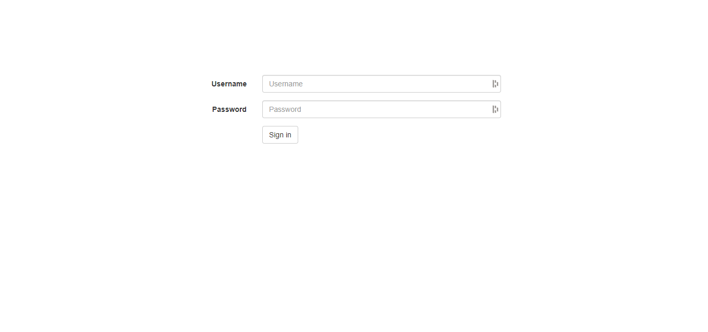
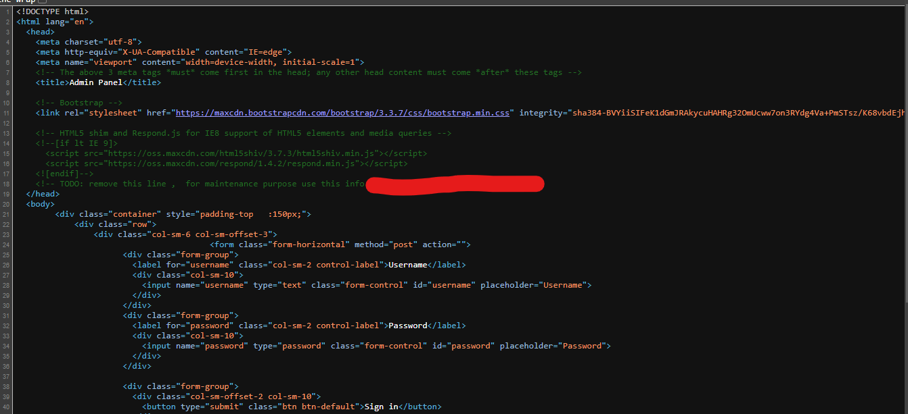
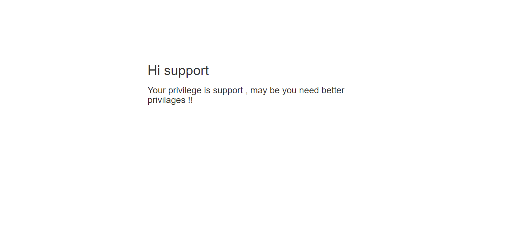

### CTF: Admin has the power - By CyberTalents 

### Category: *Web (Cookies)*
### Level: *Easy*

Description: 
Administrators only has the power to see the flag , can you be one ?
    
**Solution:**

 1. By Enterting into the given link, we get this login page
 
2. By looking into the source page we find the user and password
 
3. But if we input those credentials we still get this response 
 
4. We need to open BurpSuite for this. 
5. After checking the response in burp it's clear that as it stats in the Descriptions "Administrators only has the power to see the flag" We need to change the role to ```admin```

6. After forwarding that request we get the flag. 

