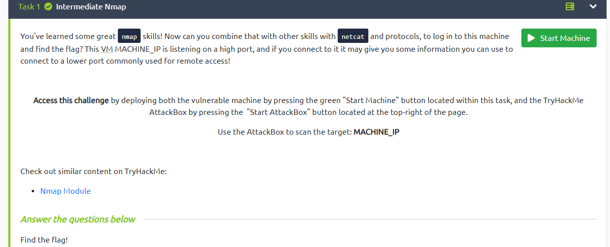
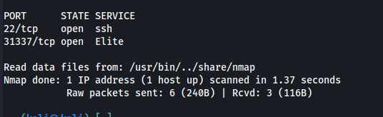
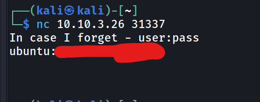
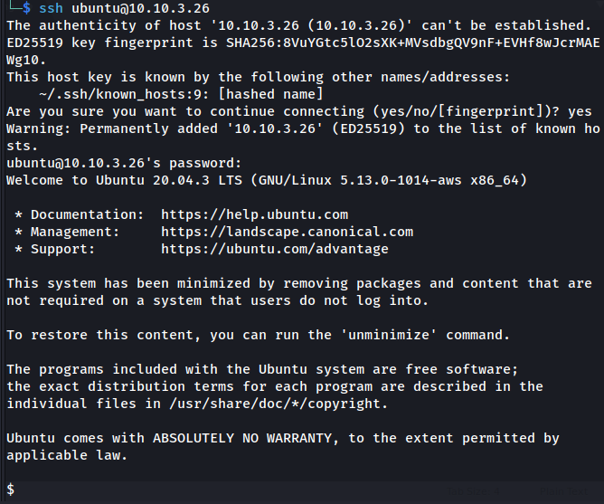
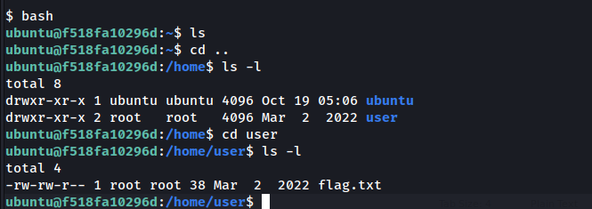

# intermediate Nmap Writup
Link to the Machine (https://tryhackme.com/room/intermediatenmap)

As it indicates in the description we will get the flag by using 2 tools Nmap and NC, It also hints that the flag is in the lower port but we will access the lower port by first accesing the higher port. 

Let’s do a simple Nmap scan 

`nmap -sS -p- <IP>`

we see that there are 2 open ports. 

Let’s try to connect to the higher port first as it says in the description;

we get a username and password in the nc response. 

now we will ssh into the port 22 by using the given username. 

we got access to the ubuntu machine. 

now we wil try to find a file for the flag 

we will the command `bash` to make things easy

and than we will look around in the directories to find the flag file 

and here it is the flag file. 

(twitter @usama445_ )

TryHackMe: [https://tryhackme.com/p/raedalialsaad](https://tryhackme.com/p/raedalialsaad)
